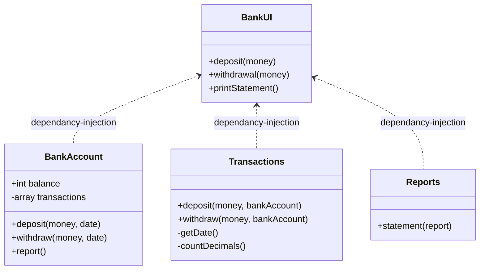
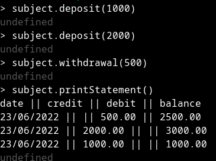

# Bank tech test for Makers Academy

Welcome to my Bank Tech Test. This is a program that runs in Node. 

# Instructions for use

Start by opening node in your command line.

You now need to bring in the classes

```
const BankAccount = require('./bankAccount');
const Transactions = require('./transactions');
const Reports = require('./reports');
const BankUI = require('./bankUI');
```

Once you have these you need to create instances of the classes, injecting the first three into BankUI as follows.

```
const bankAccount = new BankAccount;
const transactions = new Transactions;
const reports = new Reports;
const bankUI = new BankUI(bankAccount, transactions, reports);
```

Once you have this setup done you can run the program as follows.

Deposit money
```
bankUI.deposit(amount);
```
Withdraw money
```
bankUI.withdrawal(amount);
```
Print a statement
```
bankUI.printStatement();
```

# Design principles and approach

I have tried to write this using strict TDD and have I think managed to stick with this. 

I have designed the classes based on my current understanding of loose coupling and high cohesion. To achieve this there is a "parent class" called BankUI, which can also be considered as the controller. There are then three other classes which are injected into the BankUI on instantiation. The reason for this design is so classes only know about each other through the interface and can be changed without breaking other classes. A design problem I then have run into as a consequence is how to provide an easy user experience in the command line as you have a lot of setting up to do as a consequence. 

The only edge case I have considered is someone trying to deposit of withdraw an amount with too many decimal points, which then throws an errors. I did consider not allowing someone to withdraw beyond their balance, but being that I have spent a lot of time in my overdraft I felt that, at present, I would leave that and ask for clarification. I also considered throwing an error if a number was added as a string, but I have not acted on this idea. 

# Classes


<br>

## BankUI
BankUI is the parent class and is the "client facing class". This means that this is the class that people using the software interact with. When you instantiate it, you need to inject instances of Bank Account, Transactions and Reports into it. 
<br>
The interface for BankUI is very simple, just three functions:
<br><br>
deposit(money)
<br>
deposit allows a user to deposit money. When you call this function with a figure representing the amount of money, it passes this figure to transactions to format the entry, as well as passing the instance of bankAccount. 
<br><br>
withdrawal(money)
<br>
withdrawal allows the user to withdraw money. When you call this function with a figure representing the amount of money, it passes this figure to transactions to format the entry, as well as passing the instance of bankAccount. 
<br><br>
printStatement()
<br>
printStatement allows the user to print a statement. When you call this function it first console logs the headers. It then calls the statement function from the report class, and passes it the return from the report function from the bankAccount class. 

<br>

## BankAccount

BankAccount is a class that has responsibility for a single account and holding the infomation relating to that account. 
<br><br>

balance
<br>
A public attribute that holds the current balance. 
<br>

#transactions
<br>
A private array that holds objects containing transactions. 
<br>

deposit(money, date) and withdraw(money, date)
<br>
The amounts added to deposit or withdraw functions are first formatted by transactions, where a date is also added. They are then stored as objects in the private array #transactions. The public variable balance is also updated. 
<br><br>
report()
<br>
returns the array #transactions (which maybe suggests its not necessary?)
<br>

## Transactions

Transactions is a class that is responsible for formatting transactions ready to be stored in the bank account. 
<br><br>
deposit(money, bankAccount)
<br>
deposit is a function that formats a deposit. Firstly it checks if there are too many decimal places, then it adds the current date and sends it on.
<br><br>
withdraw(money, bankAccount)
<br>
withdraw is a function that formats a withdrawal. Firstly it checks if there are too many decimal places, then it adds the current date and sends it on.
<br><br>
#getDate() <br>
#getDate is a private function that gets the date and formats it.
<br><br>
#countDecimals(value)<br>
#countDecimals is a private function that counts the decimal places in a number. I reckon this could maybe be extended to check if it's two decimal places and return a boolean. I'll put that in a later version
<br>

## Report

Report is a class that has responsibility for formating the transactions from the bank account ready to print them. 
<br> <br>
statement(report)<br>
statement is a function that takes the transactions array from bankAccount and formats it into strings with the correct spacing ready to print.

# Proof of working software



# Issues encounted in development

The main issue I had was on integration. My use of `.toFixed(2)` early in the design led to failures in integration. I only realised at this stage that this function converts a number to a string. I solved this by doing this conversion at the last minute.

# Running tests

You can test this program by running the command ```jest```

# Specification

These are the specifications I was given for the task.

Requirements

* You should be able to interact with your code via a REPL like IRB or Node. (You don't need to implement a command line interface that takes input from STDIN.)
* Deposits, withdrawal.
* Account statement (date, amount, balance) printing.
* Data can be kept in memory (it doesn't need to be stored to a database or anything).

# Acceptance criteria

This is the acceptance criteria I was given for the task. 

Given a client makes a deposit of 1000 on 10-01-2023
And a deposit of 2000 on 13-01-2023
And a withdrawal of 500 on 14-01-2023
When she prints her bank statement
Then she would see

```
date || credit || debit || balance
14/01/2023 || || 500.00 || 2500.00
13/01/2023 || 2000.00 || || 3000.00
10/01/2023 || 1000.00 || || 1000.00

```

# Inputs and outputs table

```
input                                             ||          bankAccount.printStatement
--------------------------------------------------------------------------------------------------------------
no input                                          ||          date         ||  credit  ||  debit   ||  balance
                                                              
bankAccount.credit(1000.00)                       ||          date         ||  credit  ||  debit   ||  balance
                                                              (date)       ||  1000.00 ||          ||  1000.00

bankAccount.credit(2000.00)                       ||          date         ||  credit  ||  debit   ||  balance
                                                              (date)       ||  2000.00 ||          ||  3000.00
                                                              (date)       ||  1000.00 ||          ||  1000.00

bankAccount.debit(500)                            ||          date         ||  credit  ||  debit   ||  balance
                                                              (date)       ||          ||  500.00  ||  2500.00
                                                              (date)       ||  2000.00 ||          ||  3000.00
                                                              (date)       ||  1000.00 ||          ||  1000.00

bankAccount.debit(300.234)                        ||          returns error "too many decimal points"
bankAccount.debit("500")                          ||          returns error "input is not a number"

```

